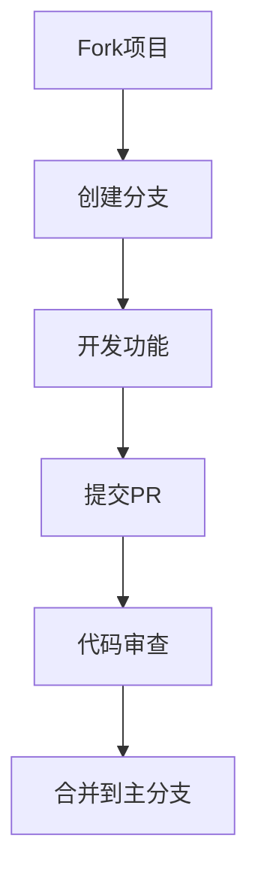

# 贡献指南

## 协作流程


## 开发规范

### 1. 分支命名
| 类型 | 格式 | 示例 |
|------|------|------|
| 功能开发 | `feature/简短描述` | `feature/user-auth` |
| Bug修复 | `fix/问题描述` | `fix/login-error` |
| 文档更新 | `docs/修改内容` | `docs/api-update` |

### 2. 提交信息规范
采用[Conventional Commits](https://www.conventionalcommits.org/)格式：
```
类型(范围): 描述

详细说明(可选)

BREAKING CHANGE: 重大变更说明(可选)
```

**常用类型**:
- `feat`: 新功能
- `fix`: Bug修复
- `docs`: 文档变更
- `style`: 代码格式
- `refactor`: 重构代码
- `test`: 测试相关
- `chore`: 构建/工具变更

## 代码风格

### Python
```python
# 遵循PEP8规范
def calculate_total(items):
    """计算总数并返回结果"""
    return sum(item.price * item.quantity 
              for item in items)
```

### JavaScript/React
```javascript
// 使用ES6+语法
const fetchUser = async (userId) => {
  const response = await api.get(`/users/${userId}`);
  return response.data;
};
```

## Pull Request要求
1. **一个PR对应一个功能/修复**
2. **必须包含**:
   - 问题描述
   - 解决方案
   - 测试用例
   - 文档更新
3. **通过所有CI检查**:
   ```bash
   - pytest (覆盖率≥80%)
   - npm run lint
   - npm run build
   ```

## 开发环境
1. **预提交检查**:
   ```bash
   # 安装pre-commit
   pre-commit install
   ```
2. **代码格式化**:
   ```bash
   # Python
   black .
   
   # JavaScript
   npm run format
   ```

## 问题报告
提交Issue时请包含：
1. 环境信息
2. 重现步骤
3. 预期行为
4. 实际行为
5. 相关日志/截图

**示例**:
```
## 环境
- OS: Ubuntu 20.04
- Python: 3.9.7
- Node: 16.14.0

## 问题描述
登录接口返回500错误...

## 重现步骤
1. 访问/login
2. 输入错误凭证
3. 观察响应
```
