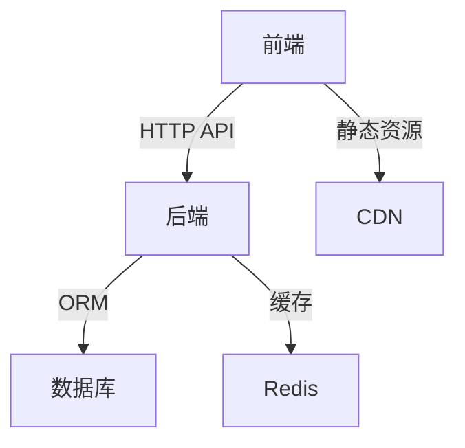
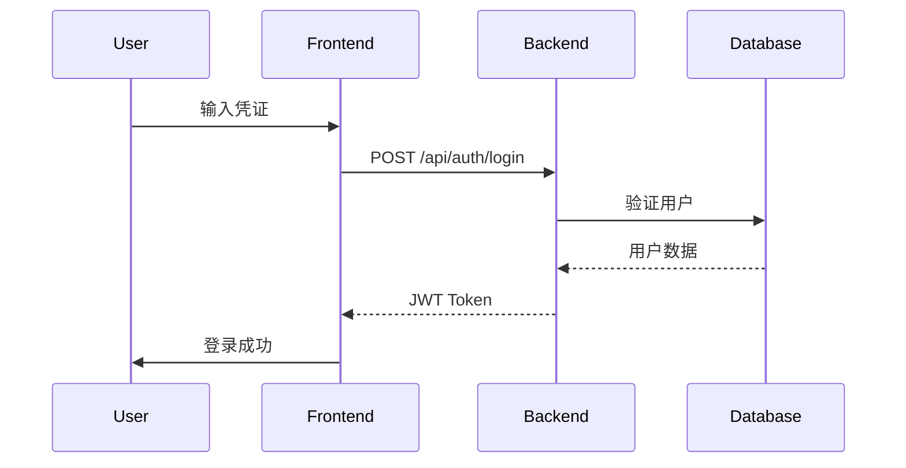
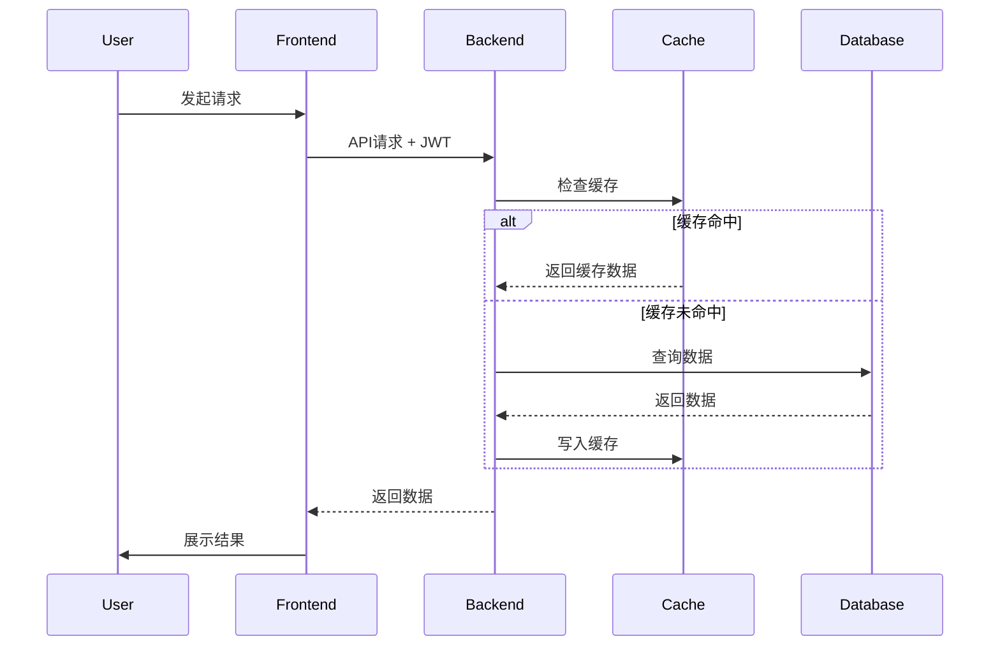
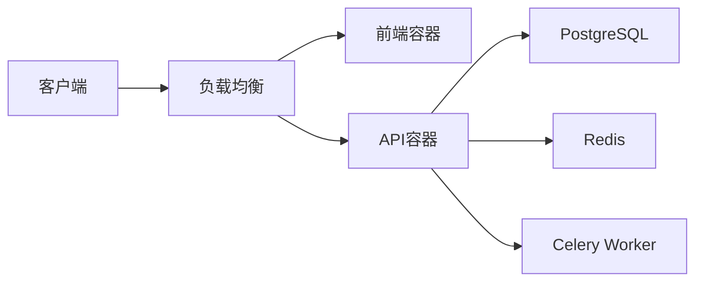

# 系统架构设计

## 架构概览

## 技术栈
### 前端
- **框架**: React + Vite
- **状态管理**: Redux Toolkit
- **UI库**: Material-UI
- **路由**: React Router

### 后端
- **语言**: Python
- **框架**: Django + Django REST Framework
- **数据库**: PostgreSQL
- **缓存**: Redis
- **任务队列**: Celery

### 基础设施
- **容器化**: Docker
- **编排**: Docker Compose
- **CI/CD**: GitHub Actions
- **监控**: Prometheus + Grafana

## 核心流程

### 用户登录流程

### 数据请求流程

## 部署架构

