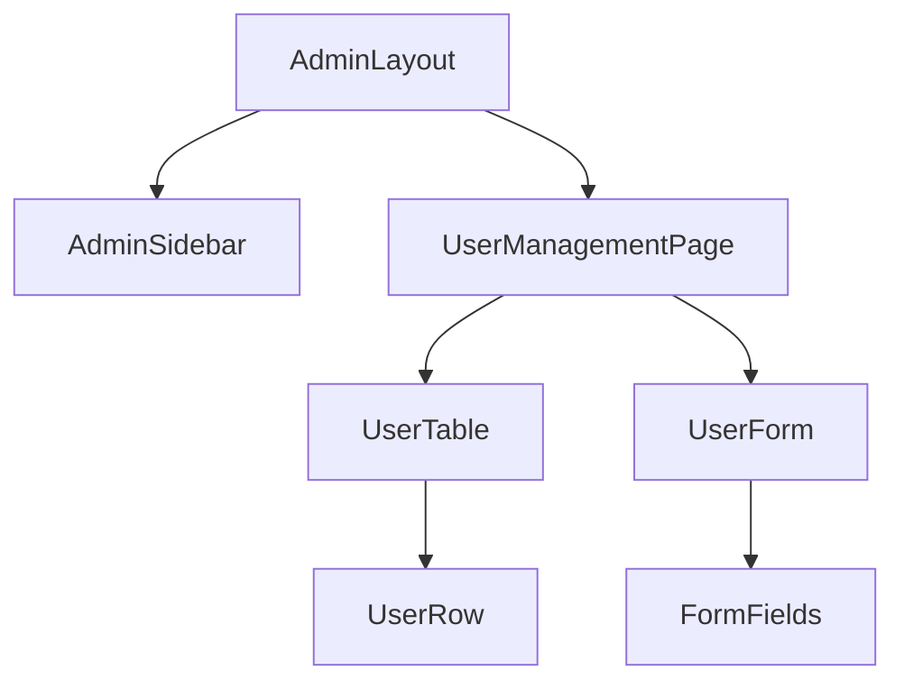
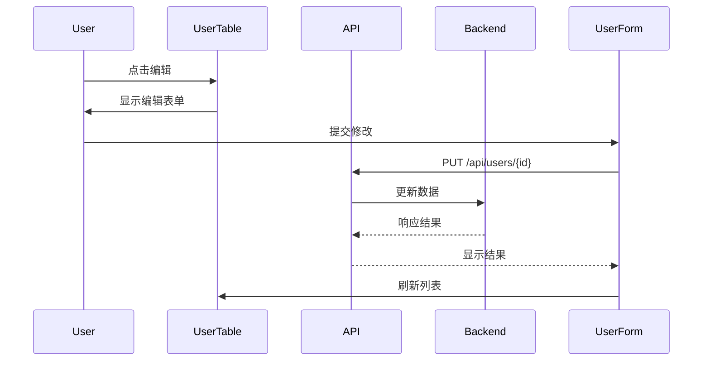

# 用户管理前端组件

## 组件概览


## 核心组件

### AdminSidebar
- **路径**: `src/components/AdminSidebar.jsx`
- **功能**: 管理员界面侧边导航
- **Props**:
  - `activeMenu` (String): 当前激活的菜单项
- **使用示例**:
```jsx
<AdminSidebar activeMenu="users" />
```

### ProtectedRoute
- **路径**: `src/components/ProtectedRoute.jsx`
- **功能**: 权限验证路由组件
- **Props**:
  - `roles` (Array): 允许访问的角色 ['admin', 'staff']
  - `component` (Component): 要渲染的组件
- **使用示例**:
```jsx
<ProtectedRoute 
  roles={['admin']}
  component={UserManagementPage}
/>
```

## 页面组件

### UserManagementPage
- **路径**: `src/pages/AdminUsersPage.jsx`
- **功能**: 用户管理主页面
- **API调用**:
```javascript
// 获取用户列表
const { data } = useGetUsersQuery({
  page: 1,
  pageSize: 20
});

// 删除用户
const [deleteUser] = useDeleteUserMutation();
```

### UserTable
- **功能**: 用户表格展示
- **Props**:
  - `users` (Array): 用户数据
  - `onEdit` (Function): 编辑回调
  - `onDelete` (Function): 删除回调
- **Columns**:
  1. ID
  2. 用户名
  3. 邮箱
  4. 状态
  5. 操作(编辑/删除)

## 交互流程

