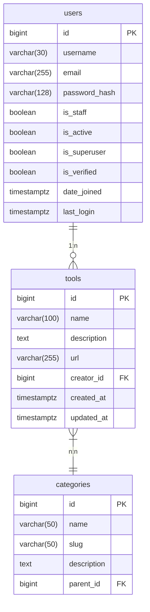

# 数据库设计文档

## 数据库概览
- **数据库类型**: PostgreSQL 13
- **字符编码**: UTF-8
- **连接池**: 最大20连接

## 数据表结构

### 用户表(users)
| 字段 | 类型 | 说明 |
|------|------|------|
| id | BIGSERIAL | 主键 |
| username | VARCHAR(30) | 用户名,唯一 |
| email | VARCHAR(255) | 邮箱,唯一 |
| password_hash | VARCHAR(128) | 加密密码 |
| is_staff | BOOLEAN | 是否员工 |
| is_active | BOOLEAN | 是否激活 |
| is_superuser | BOOLEAN | 是否超级用户 |
| is_verified | BOOLEAN | 是否验证 |
| date_joined | TIMESTAMPTZ | 注册时间 |
| last_login | TIMESTAMPTZ | 最后登录时间 |

### 工具表(tools)
| 字段 | 类型 | 说明 |
|------|------|------|
| id | BIGSERIAL | 主键 |
| name | VARCHAR(100) | 工具名称 |
| description | TEXT | 工具描述 |
| url | VARCHAR(255) | 工具链接 |
| creator_id | BIGINT | 创建人ID(外键) |
| created_at | TIMESTAMPTZ | 创建时间 |
| updated_at | TIMESTAMPTZ | 更新时间 |

### 分类表(categories)
| 字段 | 类型 | 说明 |
|------|------|------|
| id | BIGSERIAL | 主键 |
| name | VARCHAR(50) | 分类名称 |
| slug | VARCHAR(50) | URL标识 |
| description | TEXT | 分类描述 |
| parent_id | BIGINT | 父分类ID(自引用) |

## 关系图

