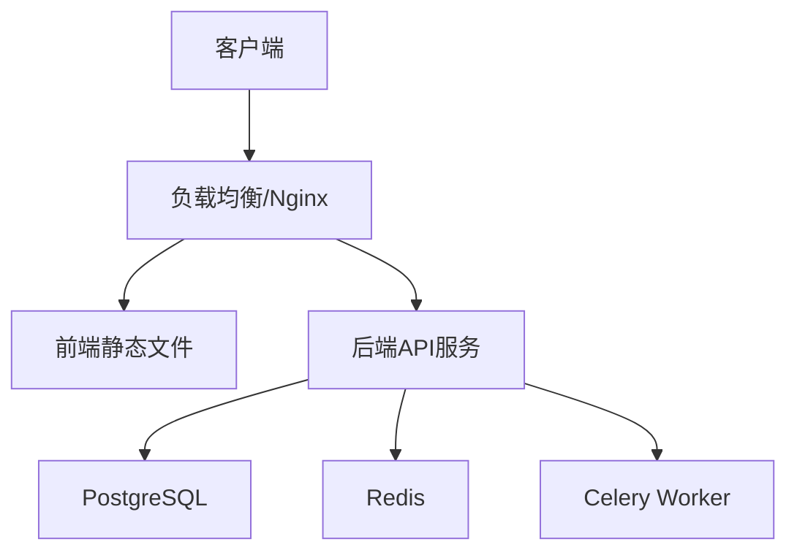

# 生产环境部署指南

## 部署架构


## 服务器要求
- **CPU**: 4核+
- **内存**: 8GB+
- **存储**: 50GB+ SSD
- **操作系统**: Ubuntu 20.04 LTS

## 1. 基础环境配置
```bash
# 安装Docker和Docker Compose
sudo apt update
sudo apt install docker.io docker-compose
sudo systemctl enable docker

# 创建部署目录
sudo mkdir -p /opt/ai-tools/{data,logs}
sudo chown -R $USER:$USER /opt/ai-tools
```

## 2. 部署后端服务
### 配置生产环境变量
创建 `.env.production`:
```ini
DEBUG=0
SECRET_KEY=your-secret-key
DATABASE_URL=postgres://user:pass@db:5432/ai_tools
REDIS_URL=redis://redis:6379/0
ALLOWED_HOSTS=.your-domain.com
```

### 启动服务
```bash
docker-compose -f docker-compose.prod.yml up -d --build
```

## 3. 部署前端服务
### 构建生产版本
```bash
cd frontend
npm run build
```

### Nginx配置示例
`/etc/nginx/sites-available/ai-tools`:
```nginx
server {
    listen 80;
    server_name your-domain.com;
    
    location / {
        root /opt/ai-tools/frontend/dist;
        try_files $uri $uri/ /index.html;
    }
    
    location /api {
        proxy_pass http://localhost:8000;
        proxy_set_header Host $host;
    }
}
```

## 4. 初始化数据库
```bash
docker-compose exec backend python manage.py migrate
docker-compose exec backend python manage.py createsuperuser
```

## 运维管理
### 常用命令
| 命令 | 说明 |
|------|------|
| `docker-compose logs -f` | 查看日志 |
| `docker-compose restart backend` | 重启后端 |
| `docker-compose exec backend bash` | 进入容器 |

### 备份恢复
```bash
# 数据库备份
docker-compose exec db pg_dump -U postgres ai_tools > backup.sql

# 恢复备份
cat backup.sql | docker-compose exec -T db psql -U postgres ai_tools
```

## 监控配置
1. **日志收集**:
   ```bash
   # 查看最近错误
   docker-compose logs --tail=100 backend | grep ERROR
   ```

2. **性能监控**:
   - Prometheus配置示例:
   ```yaml
   scrape_configs:
     - job_name: 'backend'
       static_configs:
         - targets: ['backend:8000']
   ```
