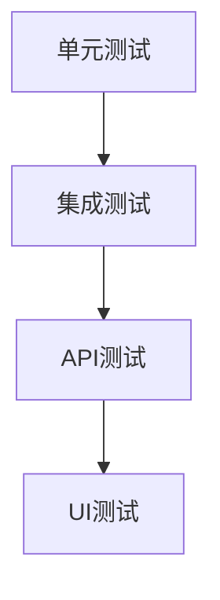

# 测试指南

## 测试策略


## 测试环境搭建
```bash
# 安装测试依赖
pip install -r requirements-test.txt
npm install --save-dev jest @testing-library/react

# 启动测试服务
docker-compose -f docker-compose.test.yml up -d
```

## 后端测试

### 1. 单元测试
```bash
# 运行所有单元测试
pytest backend/users/tests/test_models.py -v

# 生成覆盖率报告
pytest --cov=backend/users --cov-report=html
```

### 2. API测试
示例测试用例 (`backend/users/tests/test_api.py`):
```python
def test_user_list_api(client):
    response = client.get('/api/users/')
    assert response.status_code == 200
    assert len(response.json()['results']) > 0
```

## 前端测试

### 1. 组件测试
示例 (`frontend/src/__tests__/UserTable.test.jsx`):
```jsx
test('renders user table', () => {
  render(<UserTable users={mockUsers} />)
  expect(screen.getByText('admin')).toBeInTheDocument()
})
```

### 2. E2E测试
```bash
# 运行Cypress测试
npm run test:e2e
```

## 测试类型说明

| 测试类型 | 位置 | 执行命令 |
|---------|------|----------|
| 单元测试 | `backend/*/tests/test_*.py` | `pytest backend/` |
| API测试 | `backend/*/tests/test_api.py` | `pytest -m api` |
| 组件测试 | `frontend/src/__tests__/` | `npm test` |
| E2E测试 | `frontend/cypress/` | `npm run test:e2e` |

## 测试数据管理
```python
# 使用fixtures
@pytest.fixture
def admin_user():
    return User.objects.create_superuser(
        username='admin',
        email='admin@test.com'
    )
```

## 测试最佳实践
1. **命名规范**:
   - 测试文件: `test_<module>_<feature>.py`
   - 测试方法: `test_<scenario>_<expected>`

2. **测试隔离**:
   ```python
   @pytest.mark.django_db
   def test_user_creation():
       # 测试代码
   ```

3. **CI集成**:
```yaml
# GitHub Actions示例
jobs:
  test:
    steps:
      - run: pytest
      - run: npm test
```
